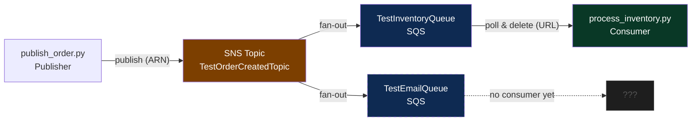

# SNS + SQS Demo

A Python demo of Amazon SNS and SQS for a Pub/Sub pattern, simulating an order creation flow that fans out to multiple downstream services.

## Architecture

```
publish_order.py       SNS Topic              SQS Queue                  Consumer
     │                     │                     │
     │──── publish ──────► │                     │
     │                     │── fan out ──►  TestInventoryQueue  ◄── process_inventory.py
     │                     │── fan out ──►  TestEmailQueue      ◄── (no consumer yet)
```




> For an animated interactive version, open [flow_diagram.html](flow_diagram.html) in a browser.

## Files

| File | Description |
|------|-------------|
| `config.py` | AWS credentials and ARN/URL constants |
| `publish_order.py` | Publishes an order payload to the SNS Topic |
| `process_inventory.py` | Polls SQS and simulates stock deduction |

## Setup

1. Create a virtual environment and install dependencies

```bash
python -m venv venv
source venv/bin/activate
pip install boto3
```

2. Edit `config.py` with your AWS credentials

```python
AWS_ACCESS_KEY_ID = 'your-access-key-id'
AWS_SECRET_ACCESS_KEY = 'your-secret-access-key'
AWS_REGION = 'ap-southeast-7'
```

## Run

Open 2 terminals and run both at the same time:

**Terminal 1 — Start the consumer**
```bash
python process_inventory.py
```

**Terminal 2 — Publish an order**
```bash
python publish_order.py
```

## AWS Resources Required

- **SNS Topic:** `TestOrderCreatedTopic`
- **SQS Queue:** `TestInventoryQueue` (subscribed to the SNS Topic)
- **SQS Queue:** `TestEmailQueue` (subscribed to the SNS Topic)

> **Note:** Do not commit `config.py` to Git as it contains credentials.
